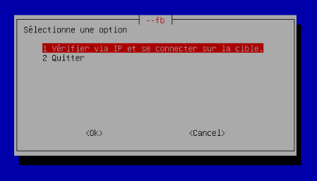
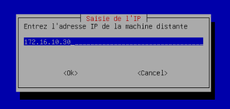
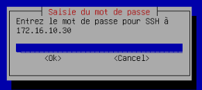
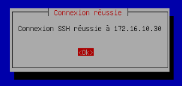
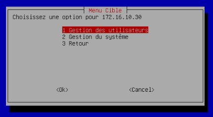
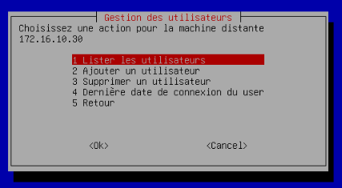
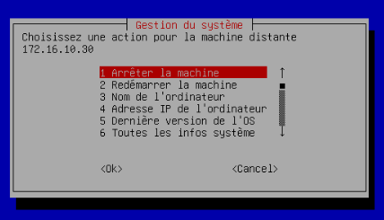
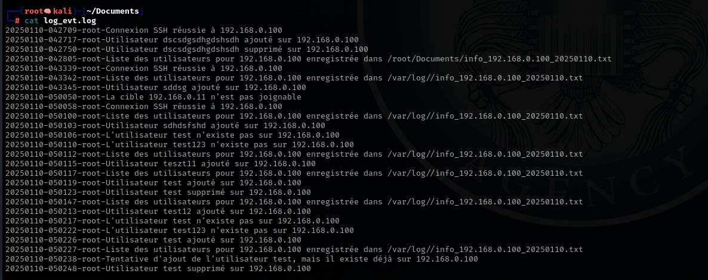
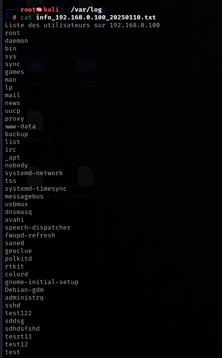

# 📚 Documentation Utilisateur
---
### 📑 Sommaire
- [🛠️ Installation & Exécution](#installation1)
- [📘 Guide](#guide)
- [🔧 Résumé Options](#resumeoptions)
---
### **🛠️ Installation & Lancement**
<span id="installation1"></span>
Il y a 2 façons différentes d'installer notre script en ligne de commande sur notre machine, soit avec `wget`, soit avec `curl`.

`wget` : 
```bash
wget https://raw.githubusercontent.com/WildCodeSchool/TSSR-2411-P2-G2/main/projet2.sh
```
`curl` : 
```bash
curl -O https://raw.githubusercontent.com/WildCodeSchool/TSSR-2411-P2-G2/main/projet2.sh
```
Si tu veux cloner tout le dépôt, tu peux aussi utiliser :

`git clone` : 
```bash
git clone https://github.com/WildCodeSchool/TSSR-2411-P2-G2.git
```
### **💻 Exécution**
Ensuite, une fois téléchargé, il faut rendre le fichier exécutable :

```bash
chmod u+x projet2.sh
```
Puis la commande pour exécuter le script:
```bash
./projet2.sh
```
---
### **📘 Guide**
<span id="guide"></span>

**Étape 1**
- Une fois le script lancé, nous pourrons voir une interface dynamique s'ouvrir avec 2 options : une option pour se connecter à une machine via une adresse IP, et la seconde option pour simplement quitter le programme.



**Étape 2**
- Entrez une adresse IP valide.



**Étape 3**
- Entrez le mot de passe de l'utilisateur en question.



**Étape 4**
- Si vous avez bien suivi les étapes, vous êtes censé arriver sur cette fenêtre pop-up. Si ce n'est pas le cas, connectez-vous d'abord en SSH avec l'invite de commande et réessayez avec le script.



**Étape 5**
- Une fois cela fait, vous allez tomber sur un menu avec 3 options :
  - [1] Gestion des utilisateurs
  - [2] Gestion du système
  - [3] Retourner en arrière dans le script"
 
  

### **Menu des gestions**
- Maintenant, libre à vous de choisir ce que vous voulez faire : soit gérer les utilisateurs sur la machine cible, soit gérer le système en pouvant voir certaines informations, interagir avec la cible en redémarrant la machine ou bien l'arrêter, etc.

**Gestion des utilisateurs**



**Gestion du système**



### **Journalisation**
Pour retrouver les logs, c'est simple, tu as deux fichiers logs que je vais te mettre ci-dessous avec leur répertoire. Tu vas pouvoir suivre toutes les actions qui seront entreprises sur la machine cible.
```bash
$HOME/Documents/log_evt.log
/var/log/
```
**Log_evt.log**



**Info log**



---
### **🔧 Résumé Options**
<span id="resumeoptions"></span>
📡 Vérification et Connexion
- **Vérification IP** : Vérifie si la machine cible est accessible via son adresse IP. Si elle est joignable, le script te demande le mot de passe SSH pour continuer.
- **Connexion SSH** : Une fois la cible validée, il se connecte automatiquement via SSH avec les identifiants fournis.

👥 Gestion des Utilisateurs
- **Lister les Utilisateurs** : Affiche tous les utilisateurs présents sur la machine cible.
- **Ajouter un Utilisateur** : Permet d'ajouter un nouvel utilisateur sur la machine.
- **Supprimer un Utilisateur** : Supprime un utilisateur existant, après avoir tué ses processus actifs.
- **Dernière Connexion d'un Utilisateur** : Affiche la dernière connexion d'un utilisateur spécifié.

💻 Gestion du Système
- **Arrêter la Machine** : Permet d'éteindre la machine distante.
- **Redémarrer la Machine** : Redémarre la machine distante.
- **Nom de l'Ordinateur** : Affiche le nom d’hôte de la machine.
- **Adresse IP de la Machine** : Affiche l'adresse IP de la machine.
- **Version du Système** : Affiche la version du système d’exploitation de la machine.
- **Informations Système** : Affiche un résumé complet des informations système.

📝 Journalisation
- **Suivi des Actions** : Toutes les actions effectuées (connexion SSH, gestion des utilisateurs, gestion du système) sont enregistrées dans un fichier de log (`log_evt.log`), pour assurer une traçabilité complète.
- **Exemple** : Une connexion réussie sera enregistrée sous la forme suivante :
20250116-123045-john-Connexion SSH réussie à `192.168.1.1`.
- **Fichier** `info_`: Pour chaque machine cible, un fichier spécifique (info_<IP>.txt) est créé pour enregistrer des informations importantes (comme la liste des utilisateurs ou les informations système), permettant de garder une trace de ces données.

🔄 Retour à l’Écran Précédent
- Chaque menu te permet de revenir en arrière, te facilitant la navigation entre les différentes sections sans quitter le programme.
